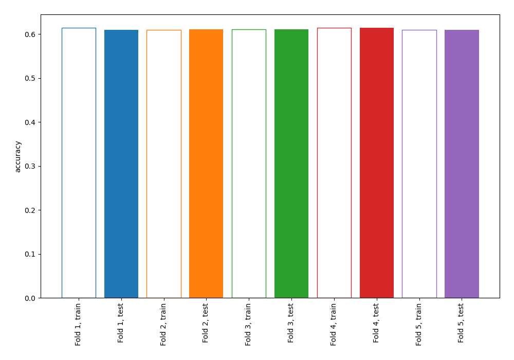
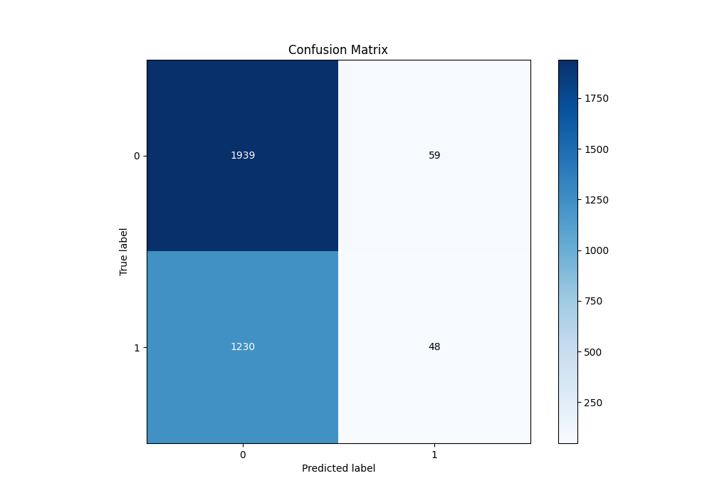
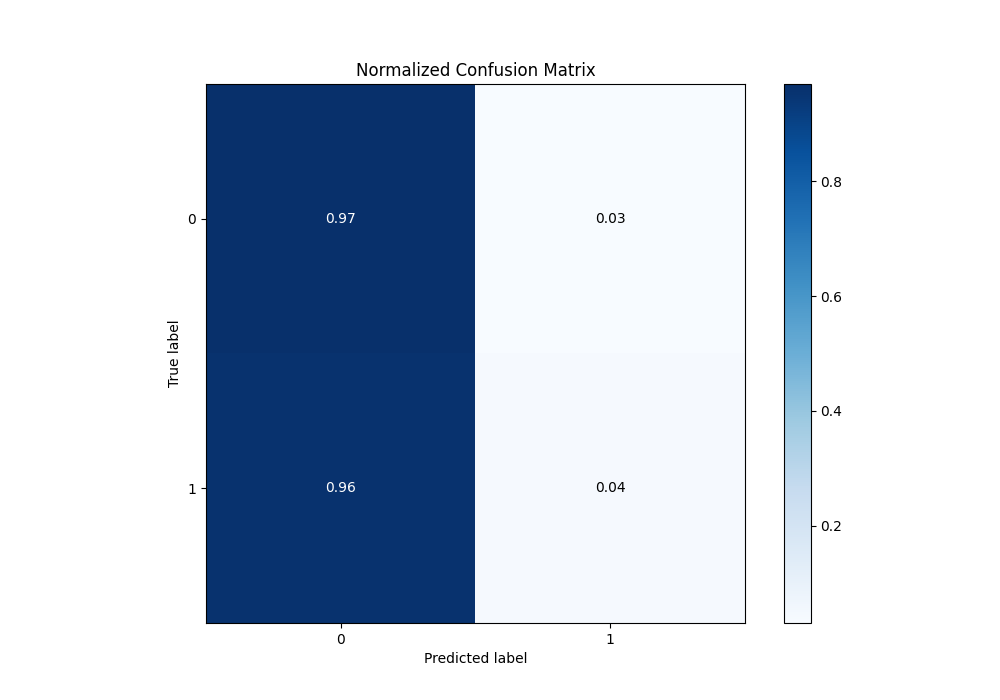
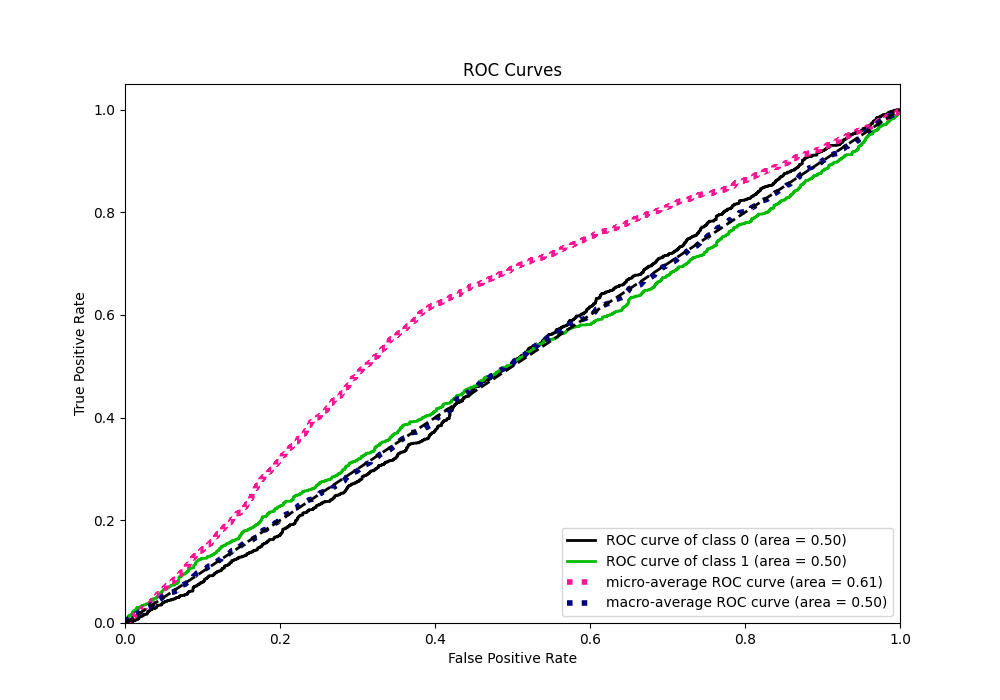
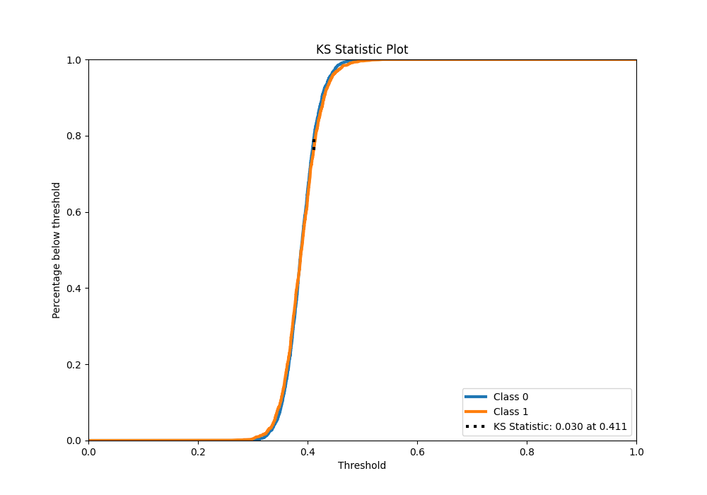
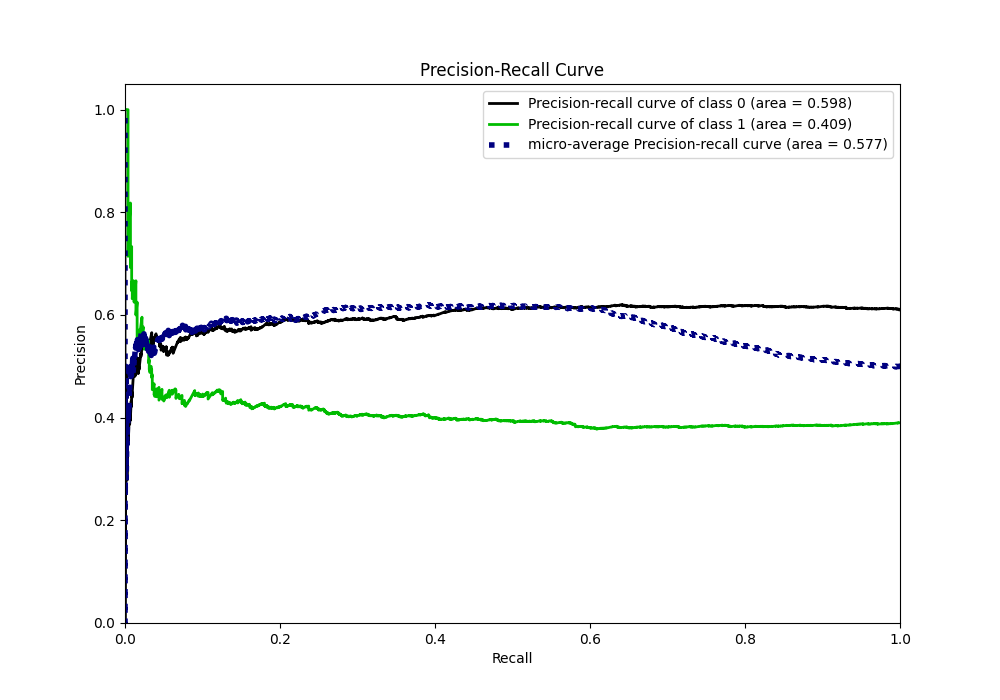
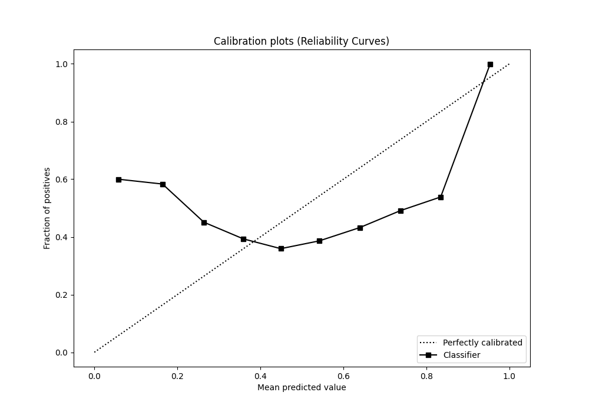
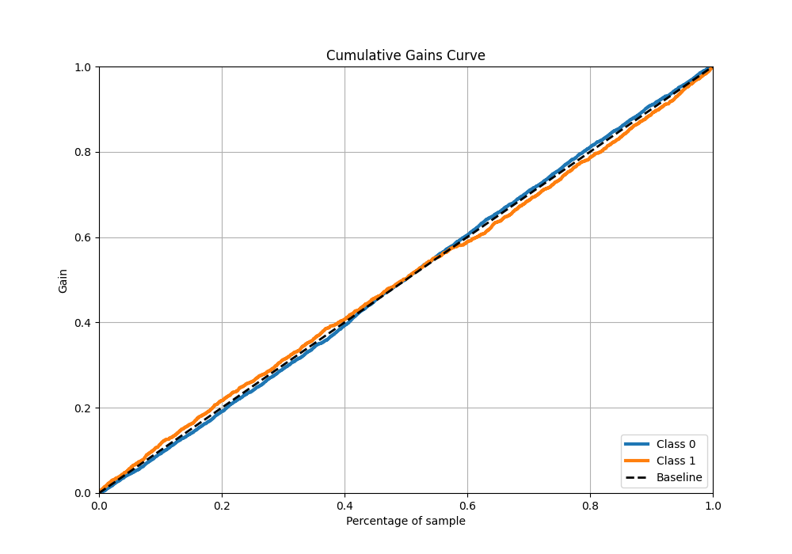
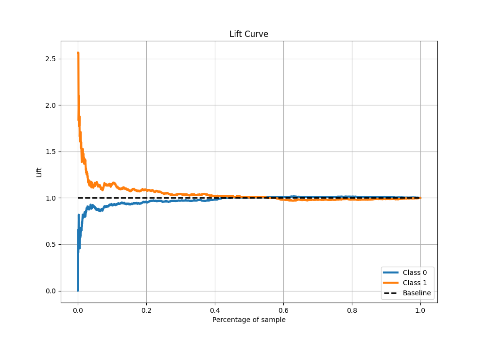

# Summary of 1_Linear

[<< Go back](../README.md)

## Logistic Regression (Linear)
- **n_jobs**: -1
- **explain_level**: 0

## Validation
 - **validation_type**: kfold
 - **k_folds**: 5
 - **shuffle**: True
 - **stratify**: True
 - **random_seed**: 123

## Optimized metric
accuracy

## Training time

2.7 seconds

## Metric details
|           |     score |   threshold |
|:----------|----------:|------------:|
| logloss   | 0.670642  |  nan        |
| auc       | 0.500349  |  nan        |
| f1        | 0.561265  |    0.235485 |
| accuracy  | 0.606532  |    0.448389 |
| precision | 0.450292  |    0.440002 |
| recall    | 1         |    0.235485 |
| mcc       | 0.0412668 |    0.427759 |

## Metric details with threshold from accuracy metric
|           |     score |   threshold |
|:----------|----------:|------------:|
| logloss   | 0.670642  |  nan        |
| auc       | 0.500349  |  nan        |
| f1        | 0.0693141 |    0.448389 |
| accuracy  | 0.606532  |    0.448389 |
| precision | 0.448598  |    0.448389 |
| recall    | 0.0375587 |    0.448389 |
| mcc       | 0.0220333 |    0.448389 |

## Confusion matrix (at threshold=0.448389)
|              |   Predicted as 0 |   Predicted as 1 |
|:-------------|-----------------:|-----------------:|
| Labeled as 0 |             1939 |               59 |
| Labeled as 1 |             1230 |               48 |

## Learning curves

## Confusion Matrix

## Normalized Confusion Matrix

## ROC Curve

## Kolmogorov-Smirnov Statistic

## Precision-Recall Curve

## Calibration Curve

## Cumulative Gains Curve

## Lift Curve

[<< Go back](../README.md)
