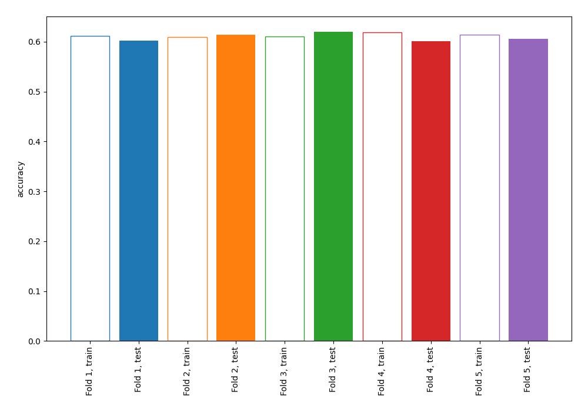
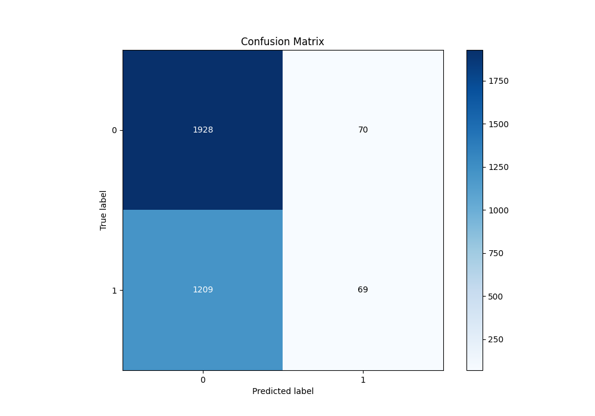
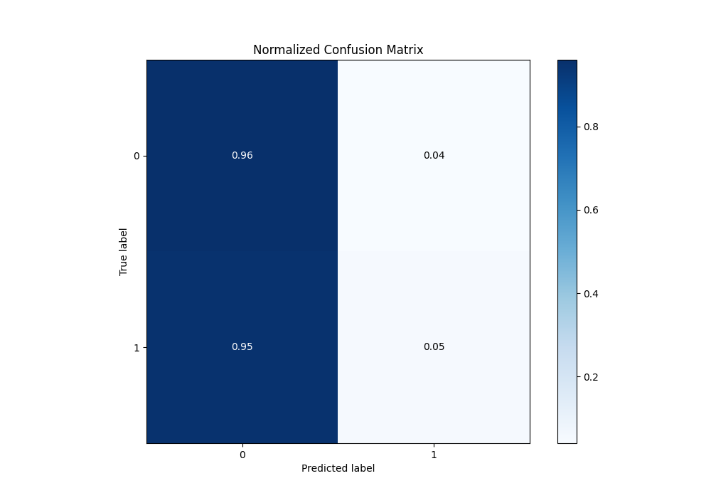
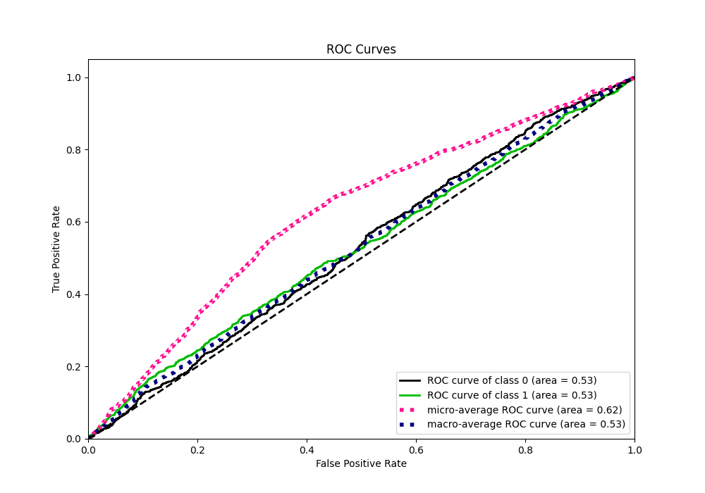
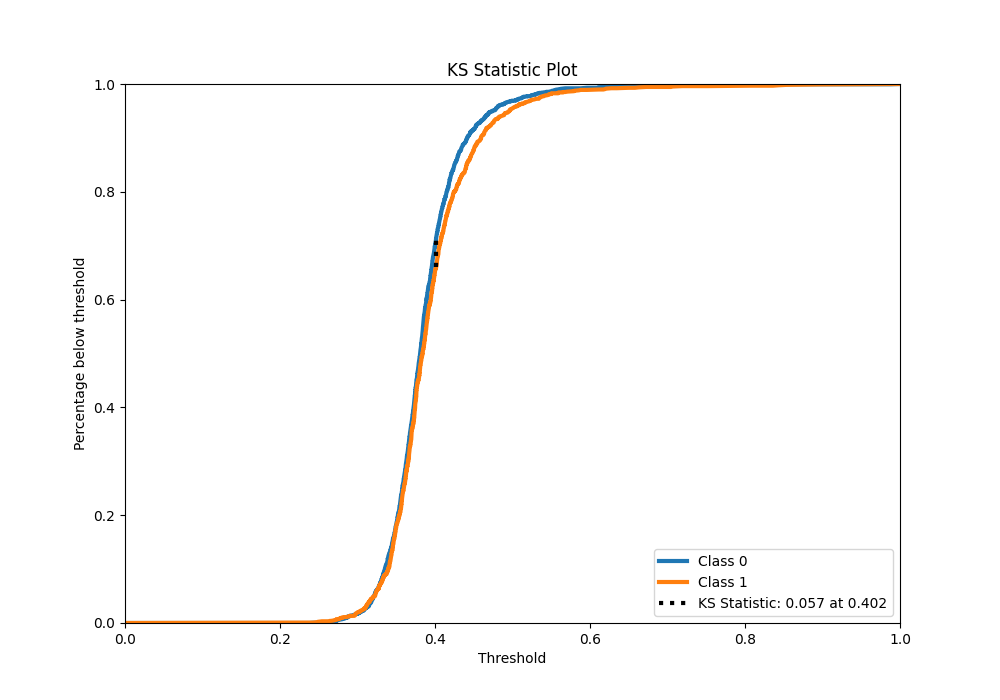
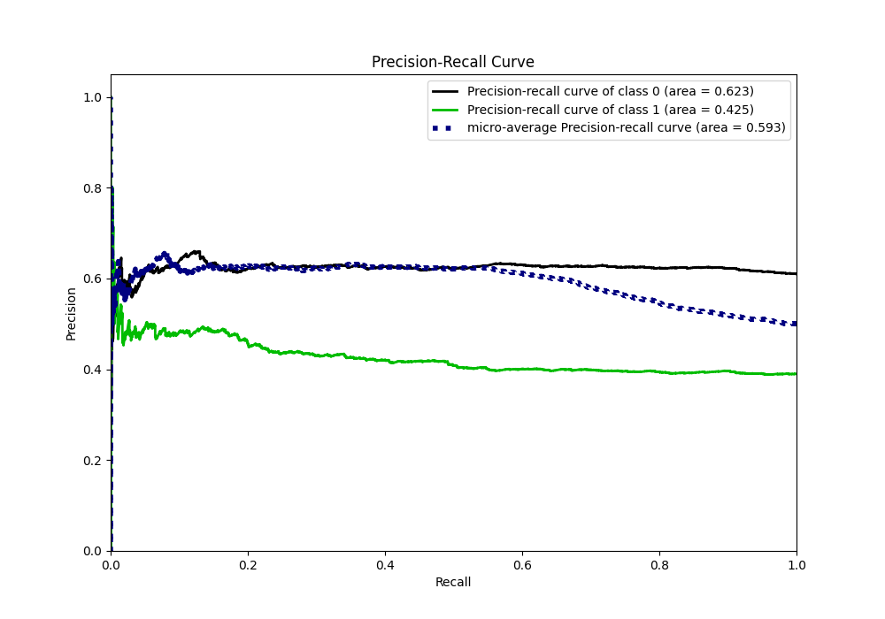
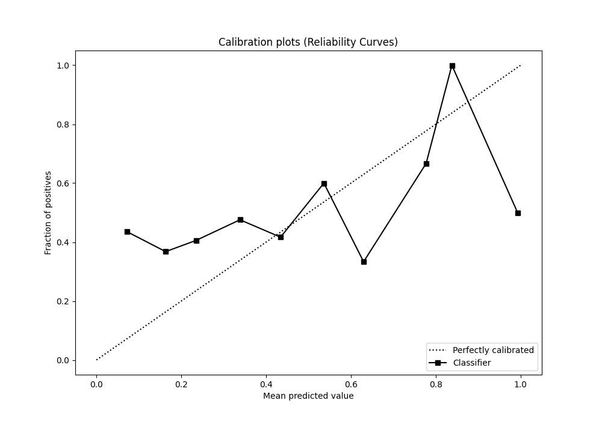
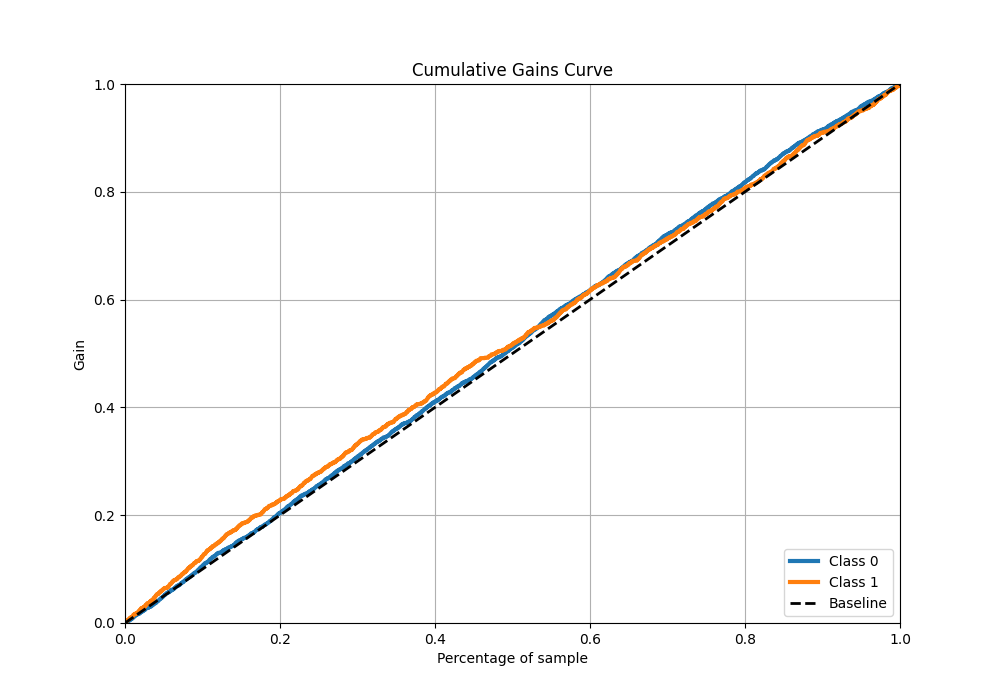
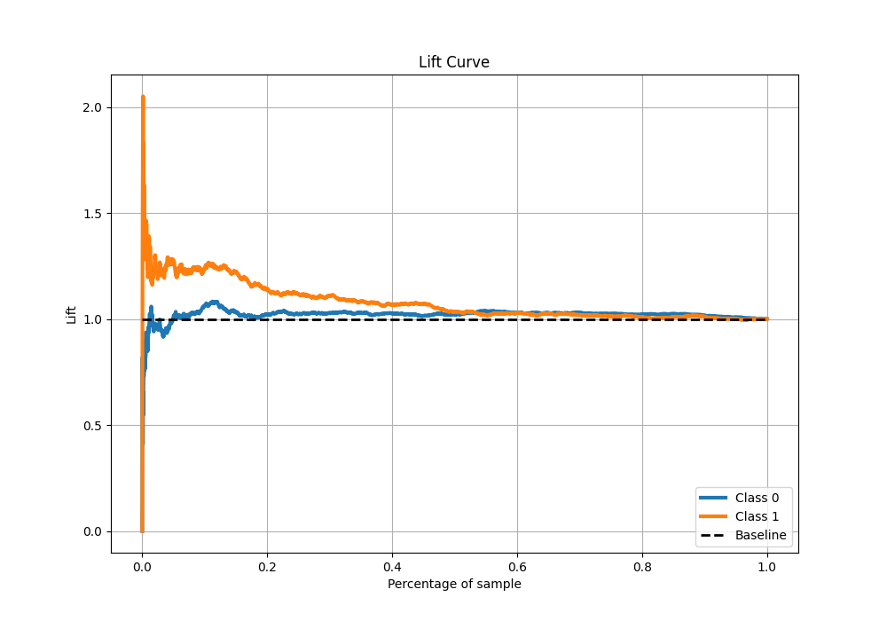

# Summary of 1_Linear_GoldenFeatures

[<< Go back](../README.md)

## Logistic Regression (Linear)
- **n_jobs**: -1
- **explain_level**: 0

## Validation
 - **validation_type**: kfold
 - **k_folds**: 5
 - **shuffle**: True
 - **stratify**: True
 - **random_seed**: 123

## Optimized metric
accuracy

## Training time

3.8 seconds

## Metric details
|           |     score |   threshold |
|:----------|----------:|------------:|
| logloss   | 0.670211  |  nan        |
| auc       | 0.528581  |  nan        |
| f1        | 0.561265  |    0.214062 |
| accuracy  | 0.609585  |    0.490995 |
| precision | 0.496403  |    0.490995 |
| recall    | 1         |    0.214062 |
| mcc       | 0.0788538 |    0.438414 |

## Metric details with threshold from accuracy metric
|           |     score |   threshold |
|:----------|----------:|------------:|
| logloss   | 0.670211  |  nan        |
| auc       | 0.528581  |  nan        |
| f1        | 0.0973888 |    0.490995 |
| accuracy  | 0.609585  |    0.490995 |
| precision | 0.496403  |    0.490995 |
| recall    | 0.0539906 |    0.490995 |
| mcc       | 0.0458707 |    0.490995 |

## Confusion matrix (at threshold=0.490995)
|              |   Predicted as 0 |   Predicted as 1 |
|:-------------|-----------------:|-----------------:|
| Labeled as 0 |             1928 |               70 |
| Labeled as 1 |             1209 |               69 |

## Learning curves

## Confusion Matrix

## Normalized Confusion Matrix

## ROC Curve

## Kolmogorov-Smirnov Statistic

## Precision-Recall Curve

## Calibration Curve

## Cumulative Gains Curve

## Lift Curve

[<< Go back](../README.md)
