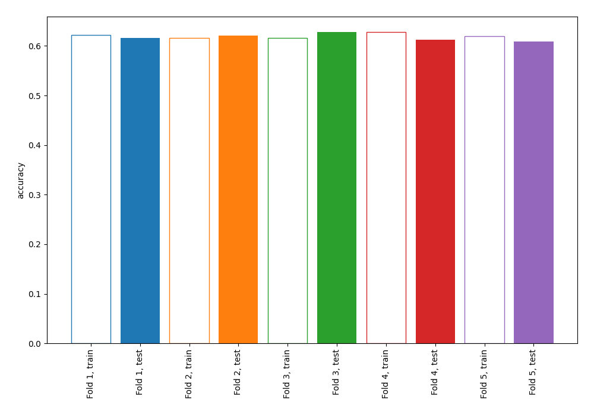
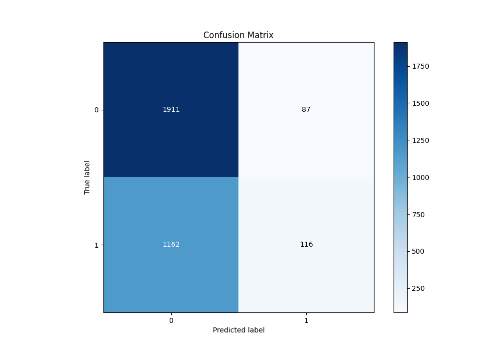
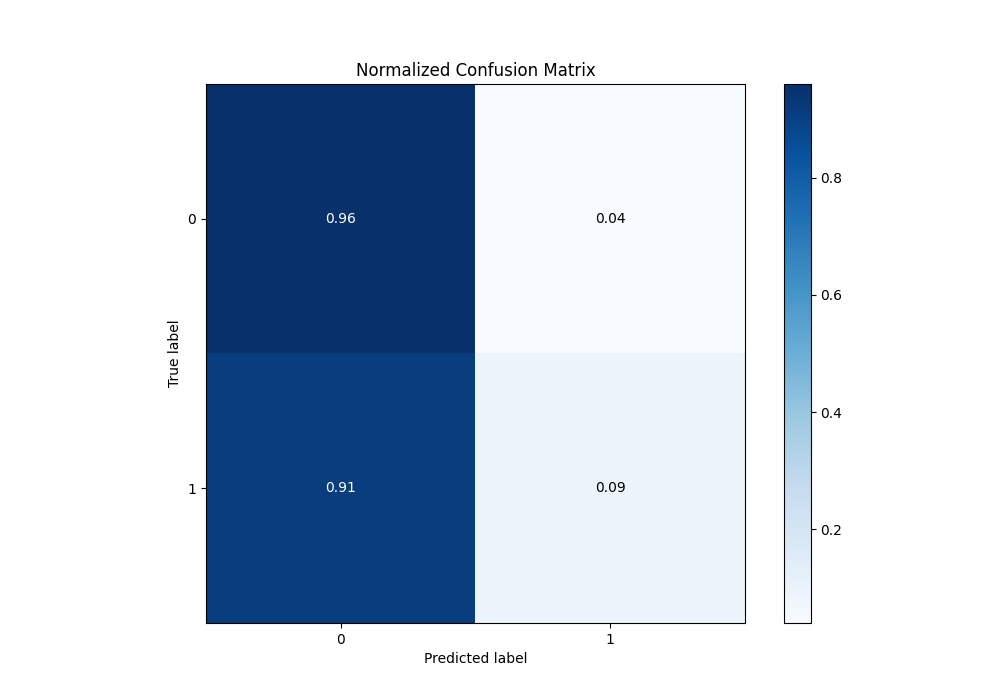
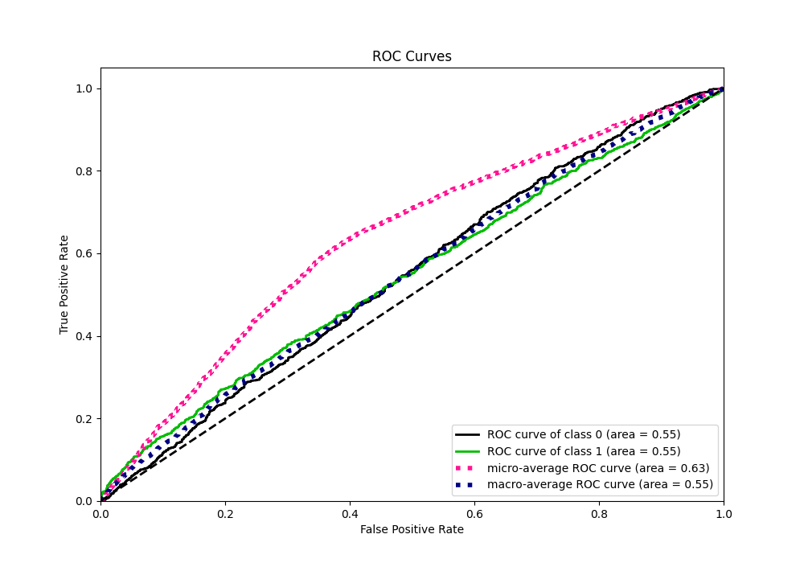
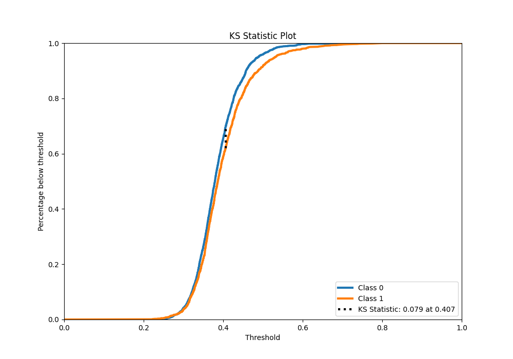
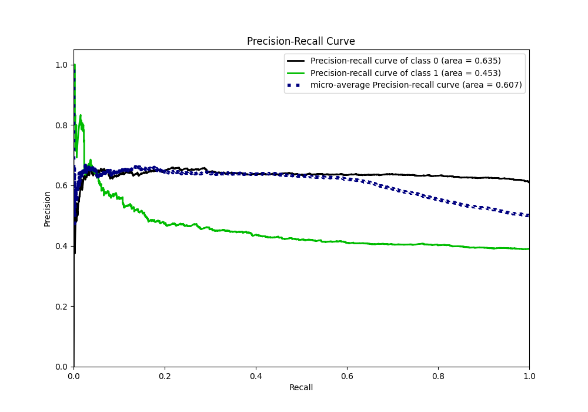
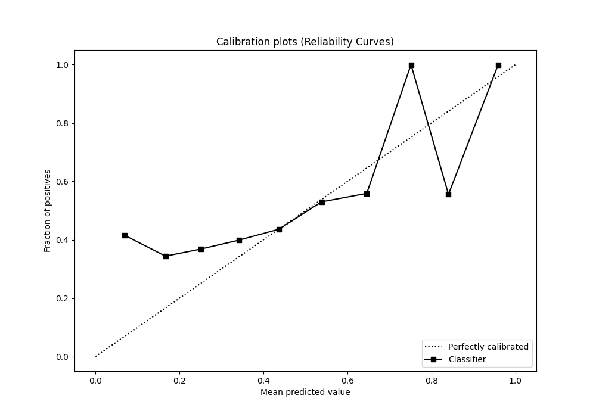
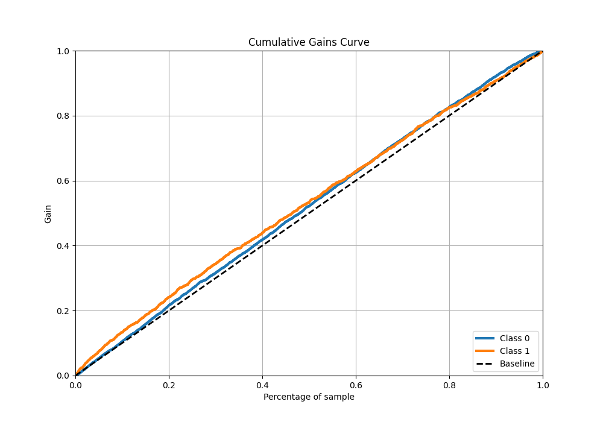
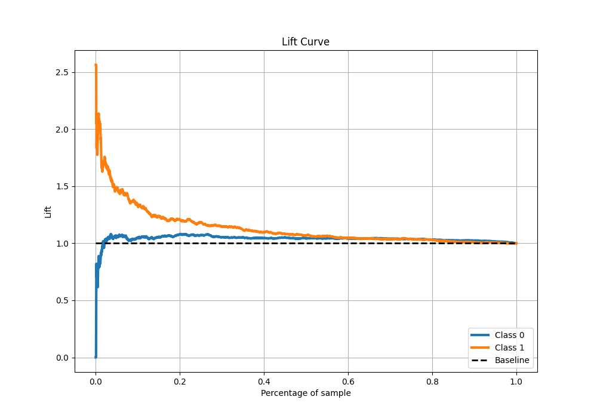

# Summary of 1_Linear_KMeansFeatures

[<< Go back](../README.md)

## Logistic Regression (Linear)
- **n_jobs**: -1
- **explain_level**: 0

## Validation
 - **validation_type**: kfold
 - **k_folds**: 5
 - **shuffle**: True
 - **stratify**: True
 - **random_seed**: 123

## Optimized metric
accuracy

## Training time

2.6 seconds

## Metric details
|           |     score |   threshold |
|:----------|----------:|------------:|
| logloss   | 0.664475  |  nan        |
| auc       | 0.546267  |  nan        |
| f1        | 0.561265  |    0.198139 |
| accuracy  | 0.618742  |    0.494607 |
| precision | 0.635514  |    0.528881 |
| recall    | 1         |    0.198139 |
| mcc       | 0.0955411 |    0.494607 |

## Metric details with threshold from accuracy metric
|           |     score |   threshold |
|:----------|----------:|------------:|
| logloss   | 0.664475  |  nan        |
| auc       | 0.546267  |  nan        |
| f1        | 0.156651  |    0.494607 |
| accuracy  | 0.618742  |    0.494607 |
| precision | 0.571429  |    0.494607 |
| recall    | 0.0907668 |    0.494607 |
| mcc       | 0.0955411 |    0.494607 |

## Confusion matrix (at threshold=0.494607)
|              |   Predicted as 0 |   Predicted as 1 |
|:-------------|-----------------:|-----------------:|
| Labeled as 0 |             1911 |               87 |
| Labeled as 1 |             1162 |              116 |

## Learning curves

## Confusion Matrix

## Normalized Confusion Matrix

## ROC Curve

## Kolmogorov-Smirnov Statistic

## Precision-Recall Curve

## Calibration Curve

## Cumulative Gains Curve

## Lift Curve

[<< Go back](../README.md)
