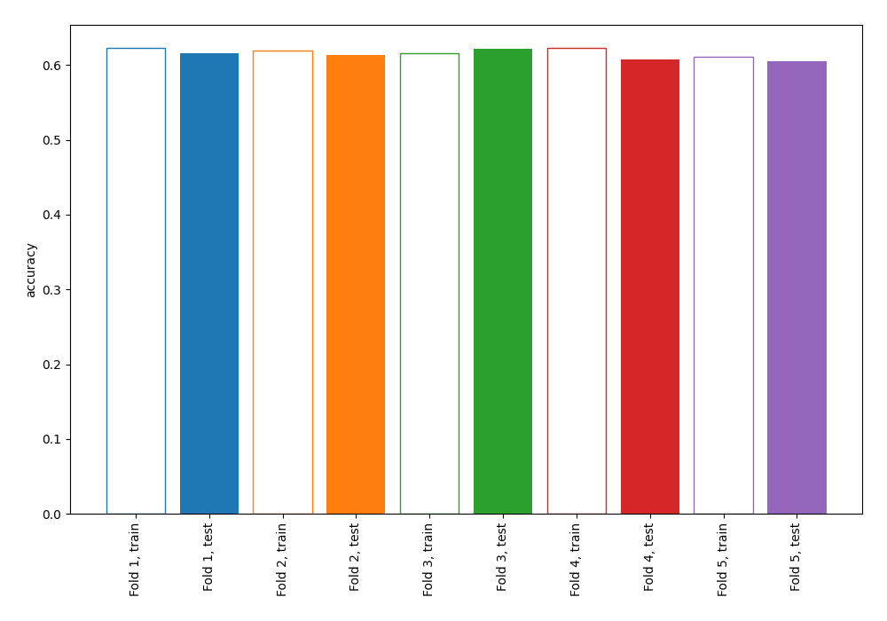
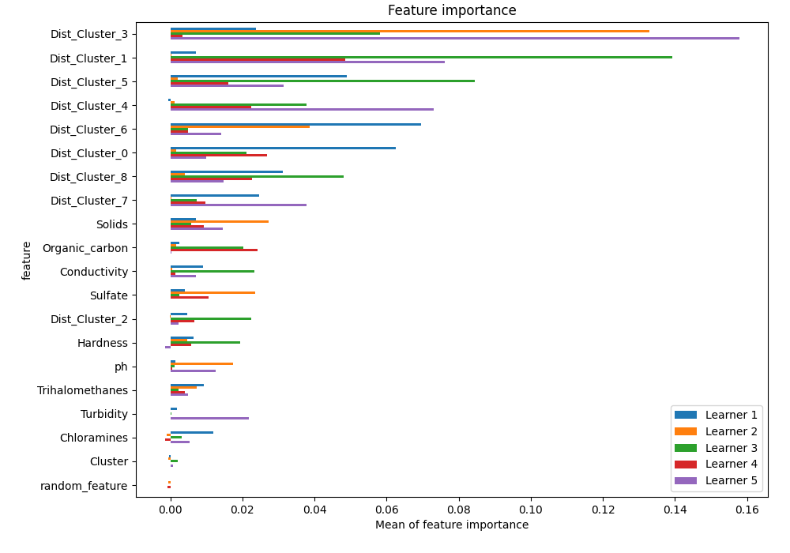
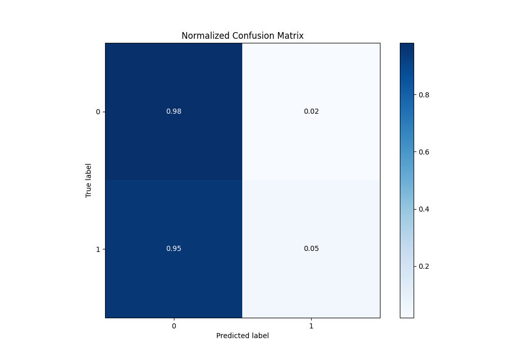
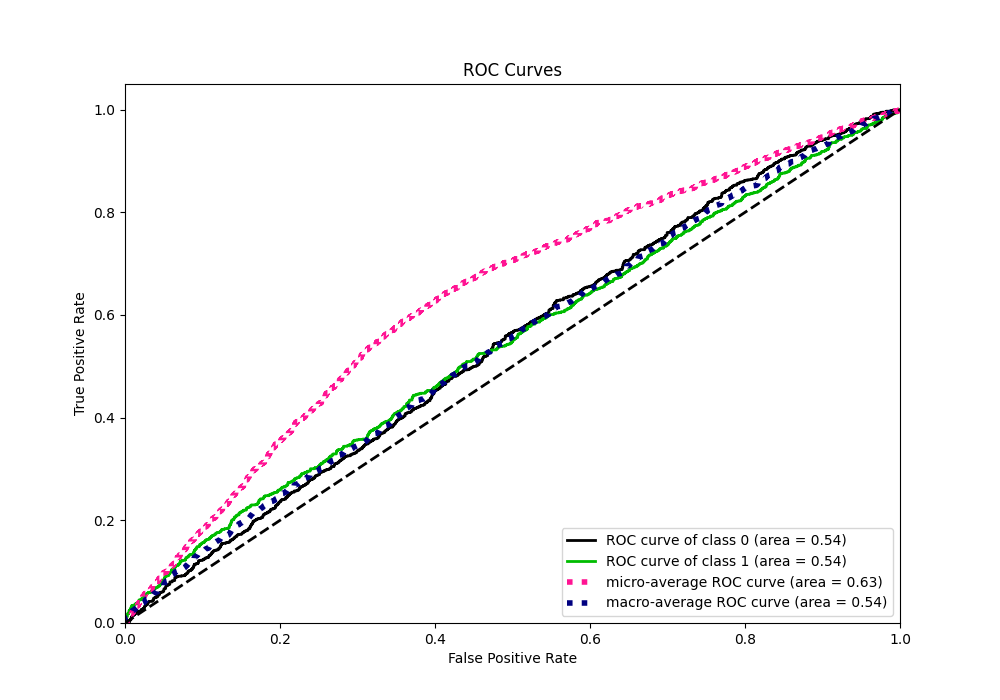
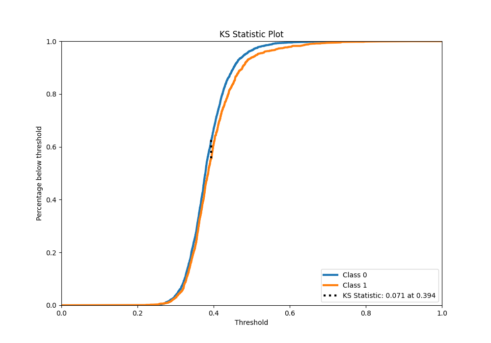
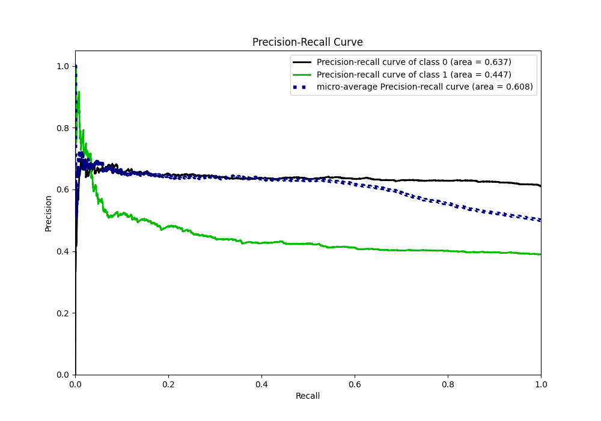
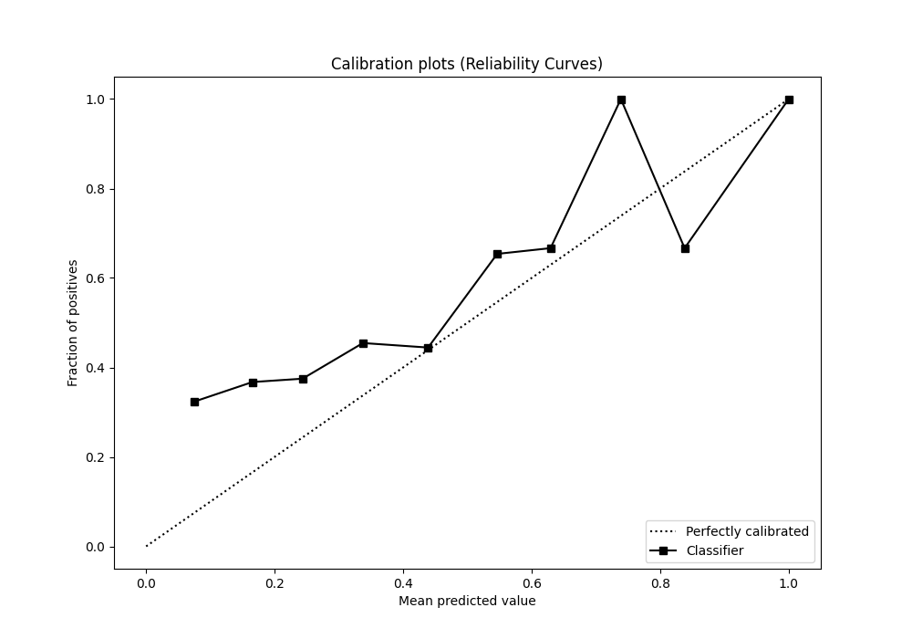
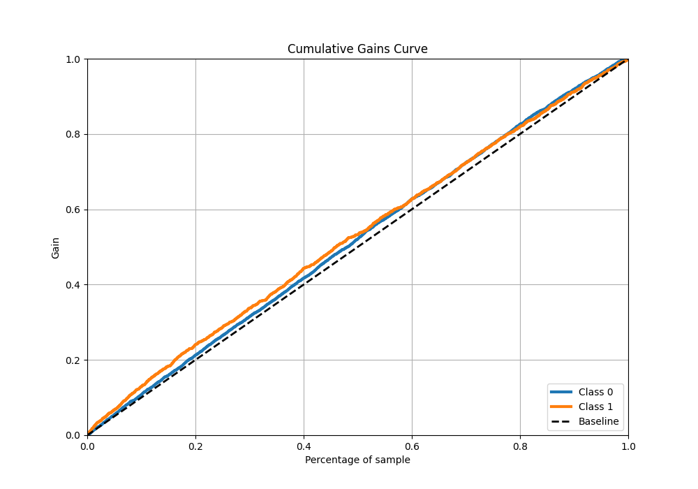
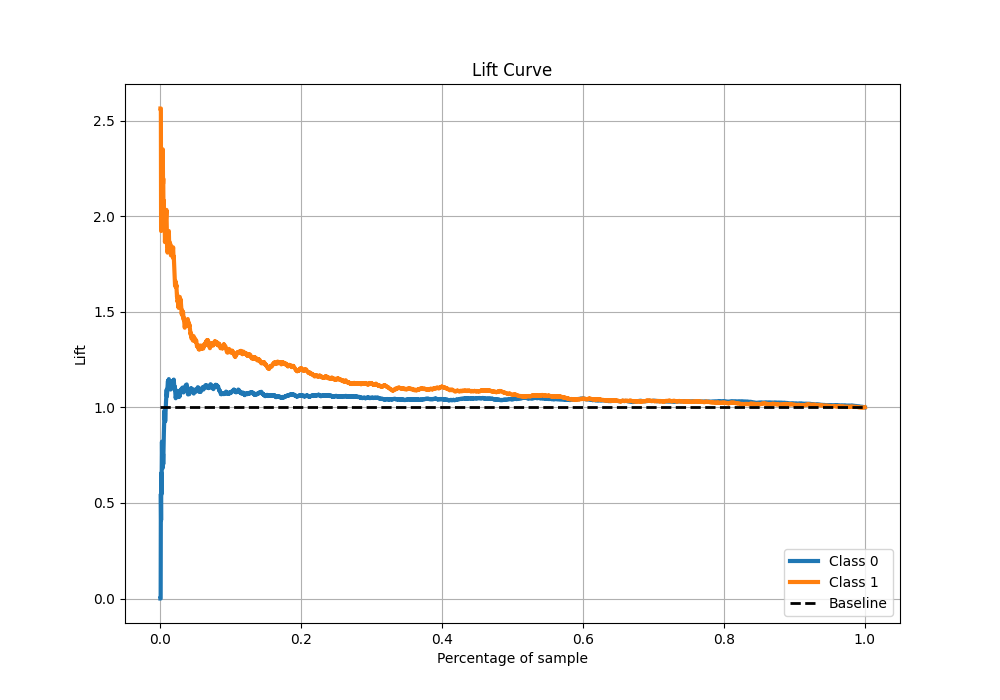

# Summary of 1_Linear_KMeansFeatures_RandomFeature

[<< Go back](../README.md)

## Logistic Regression (Linear)
- **n_jobs**: -1
- **explain_level**: 1

## Validation
 - **validation_type**: kfold
 - **k_folds**: 5
 - **shuffle**: True
 - **stratify**: True
 - **random_seed**: 123

## Optimized metric
accuracy

## Training time

3.1 seconds

## Metric details
|           |     score |   threshold |
|:----------|----------:|------------:|
| logloss   | 0.664685  |  nan        |
| auc       | 0.543105  |  nan        |
| f1        | 0.561265  |    0.197816 |
| accuracy  | 0.615079  |    0.516948 |
| precision | 0.579439  |    0.516948 |
| recall    | 1         |    0.197816 |
| mcc       | 0.0848624 |    0.433636 |

## Metric details with threshold from accuracy metric
|           |     score |   threshold |
|:----------|----------:|------------:|
| logloss   | 0.664685  |  nan        |
| auc       | 0.543105  |  nan        |
| f1        | 0.0895307 |    0.516948 |
| accuracy  | 0.615079  |    0.516948 |
| precision | 0.579439  |    0.516948 |
| recall    | 0.0485133 |    0.516948 |
| mcc       | 0.071323  |    0.516948 |

## Confusion matrix (at threshold=0.516948)
|              |   Predicted as 0 |   Predicted as 1 |
|:-------------|-----------------:|-----------------:|
| Labeled as 0 |             1953 |               45 |
| Labeled as 1 |             1216 |               62 |

## Learning curves

## Coefficients
| feature         |   Learner_1 |   Learner_2 |   Learner_3 |   Learner_4 |    Learner_5 |
|:----------------|------------:|------------:|------------:|------------:|-------------:|
| Dist_Cluster_3  |  0.335103   |  0.695293   |   0.448504  |  0.232474   |  0.893525    |
| Solids          |  0.25193    |  0.393669   |   0.127771  |  0.256385   |  0.277721    |
| Dist_Cluster_6  |  0.597936   | -0.39611    |   0.121988  | -0.106434   |  0.222734    |
| Conductivity    | -0.269703   |  0.0401994  |   0.264296  | -0.0387375  |  0.214689    |
| random_feature  | -0.00635238 |  0.0330666  |   0.0226307 |  0.0657623  |  0.0150422   |
| Dist_Cluster_5  |  0.478943   |  0.0744188  |  -0.719819  | -0.211274   |  0.464483    |
| Chloramines     | -0.212055   | -0.0796349  |   0.0916161 |  0.168562   |  0.109484    |
| Hardness        | -0.113884   |  0.115037   |   0.294606  | -0.195124   | -0.0553113   |
| Dist_Cluster_8  | -0.281476   | -0.137797   |   0.446458  | -0.346586   |  0.315349    |
| Cluster         | -0.060763   |  0.0532299  |  -0.118937  | -0.0128731  | -0.0224416   |
| Dist_Cluster_7  | -0.273221   |  0.0687375  |   0.151966  |  0.238211   | -0.396503    |
| Trihalomethanes | -0.150115   | -0.191928   |   0.0793364 | -0.053005   |  0.0740231   |
| Dist_Cluster_2  | -0.0859773  |  0.00375578 |  -0.314797  |  0.156232   | -0.0578526   |
| Turbidity       | -0.220995   |  0.0601575  |   0.0446873 |  0.00409534 | -0.297197    |
| Dist_Cluster_1  | -0.160894   | -0.0247968  |   0.757191  | -0.464984   | -0.56217     |
| Dist_Cluster_0  | -0.509782   | -0.0657954  |  -0.307873  |  0.379725   | -0.123693    |
| Dist_Cluster_4  |  0.0779495  | -0.0494621  |  -0.413848  |  0.298427   | -0.550209    |
| ph              |  0.0933204  | -0.266854   |  -0.116186  | -0.0188648  | -0.335506    |
| Sulfate         | -0.126628   | -0.273044   |  -0.166208  | -0.234387   | -0.000930209 |
| Organic_carbon  | -0.144922   | -0.0488283  |  -0.276319  | -0.334842   | -0.0372584   |
| intercept       | -0.453303   | -0.451172   |  -0.451931  | -0.452439   | -0.453354    |

## Permutation-based Importance

## Confusion Matrix

## Normalized Confusion Matrix

## ROC Curve

## Kolmogorov-Smirnov Statistic

## Precision-Recall Curve

## Calibration Curve

## Cumulative Gains Curve

## Lift Curve

[<< Go back](../README.md)
