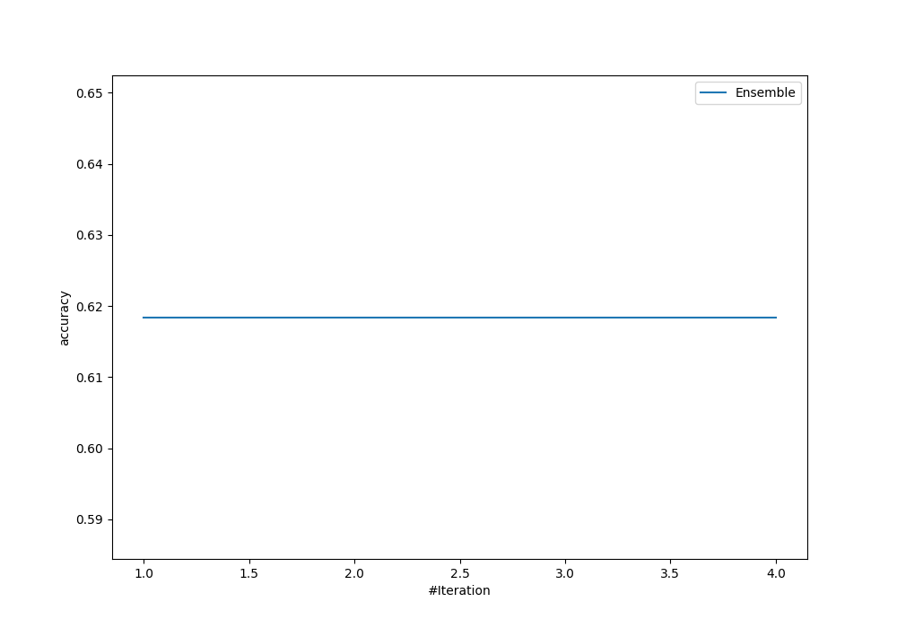
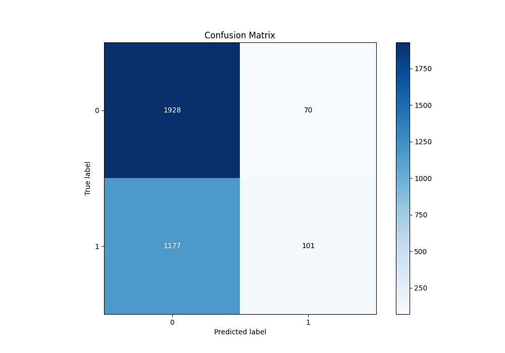
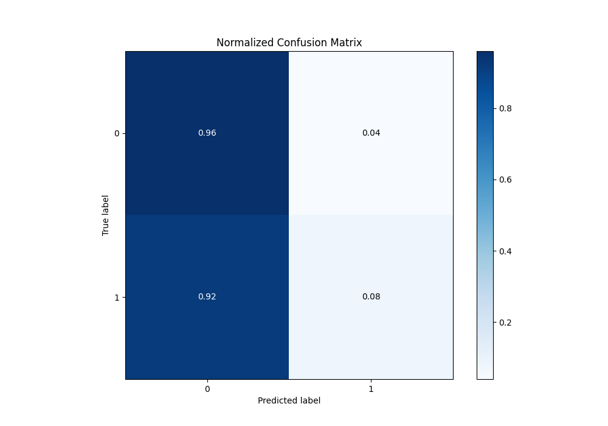
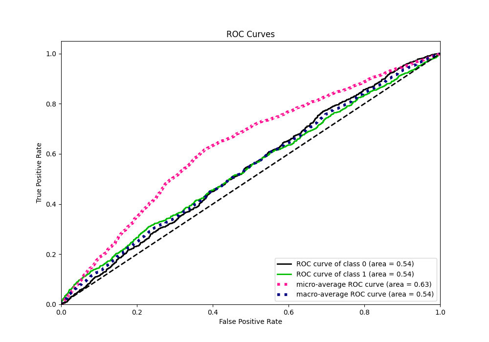
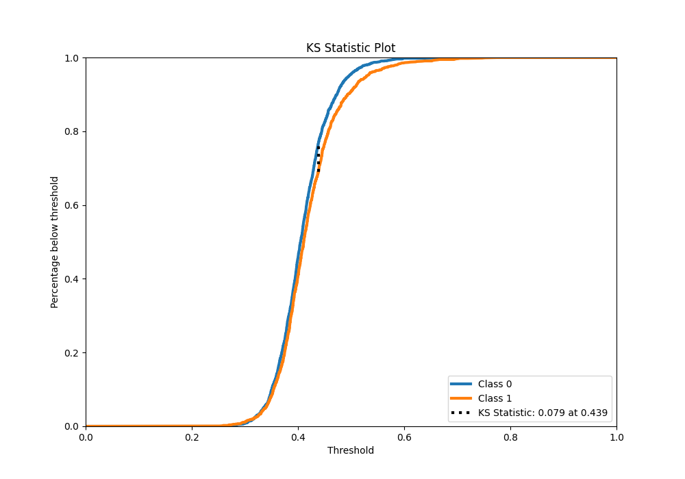
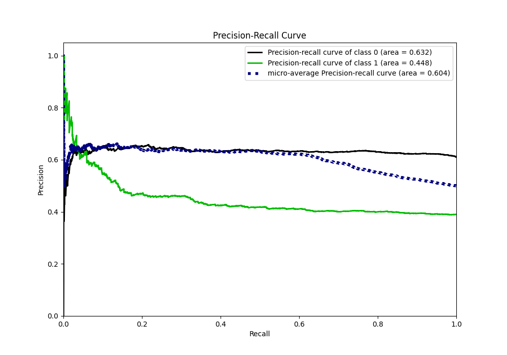
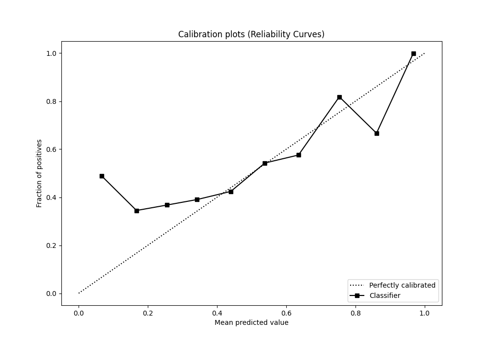
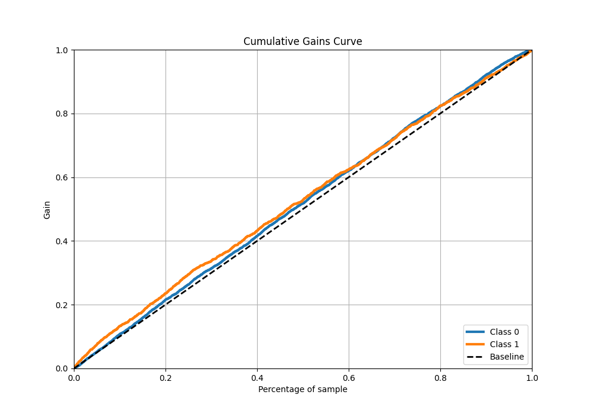
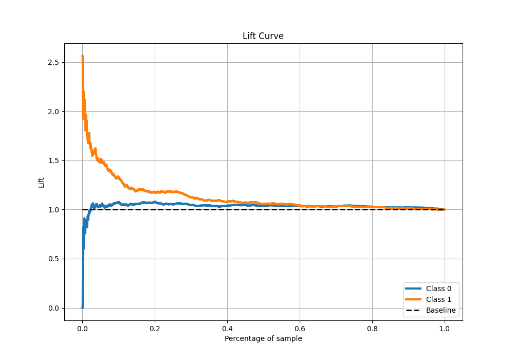

# Summary of Ensemble

[<< Go back](../README.md)

## Ensemble structure
| Model                                 |   Weight |
|:--------------------------------------|---------:|
| 1_Linear_KMeansFeatures_BoostOnErrors |        1 |

## Metric details
|           |     score |   threshold |
|:----------|----------:|------------:|
| logloss   | 0.666153  |  nan        |
| auc       | 0.541228  |  nan        |
| f1        | 0.561265  |    0.227053 |
| accuracy  | 0.619353  |    0.508827 |
| precision | 0.616822  |    0.5287   |
| recall    | 1         |    0.227053 |
| mcc       | 0.0964794 |    0.508827 |

## Metric details with threshold from accuracy metric
|           |     score |   threshold |
|:----------|----------:|------------:|
| logloss   | 0.666153  |  nan        |
| auc       | 0.541228  |  nan        |
| f1        | 0.139406  |    0.508827 |
| accuracy  | 0.619353  |    0.508827 |
| precision | 0.590643  |    0.508827 |
| recall    | 0.0790297 |    0.508827 |
| mcc       | 0.0964794 |    0.508827 |

## Confusion matrix (at threshold=0.508827)
|              |   Predicted as 0 |   Predicted as 1 |
|:-------------|-----------------:|-----------------:|
| Labeled as 0 |             1928 |               70 |
| Labeled as 1 |             1177 |              101 |

## Learning curves

## Confusion Matrix

## Normalized Confusion Matrix

## ROC Curve

## Kolmogorov-Smirnov Statistic

## Precision-Recall Curve

## Calibration Curve

## Cumulative Gains Curve

## Lift Curve

[<< Go back](../README.md)
