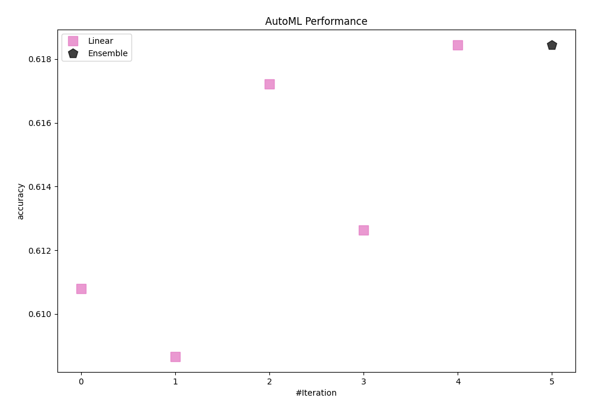
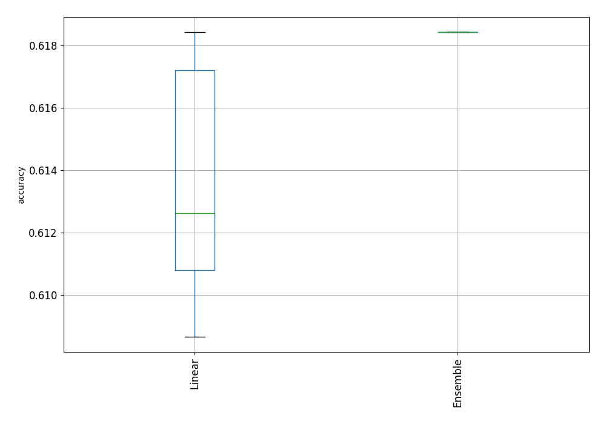
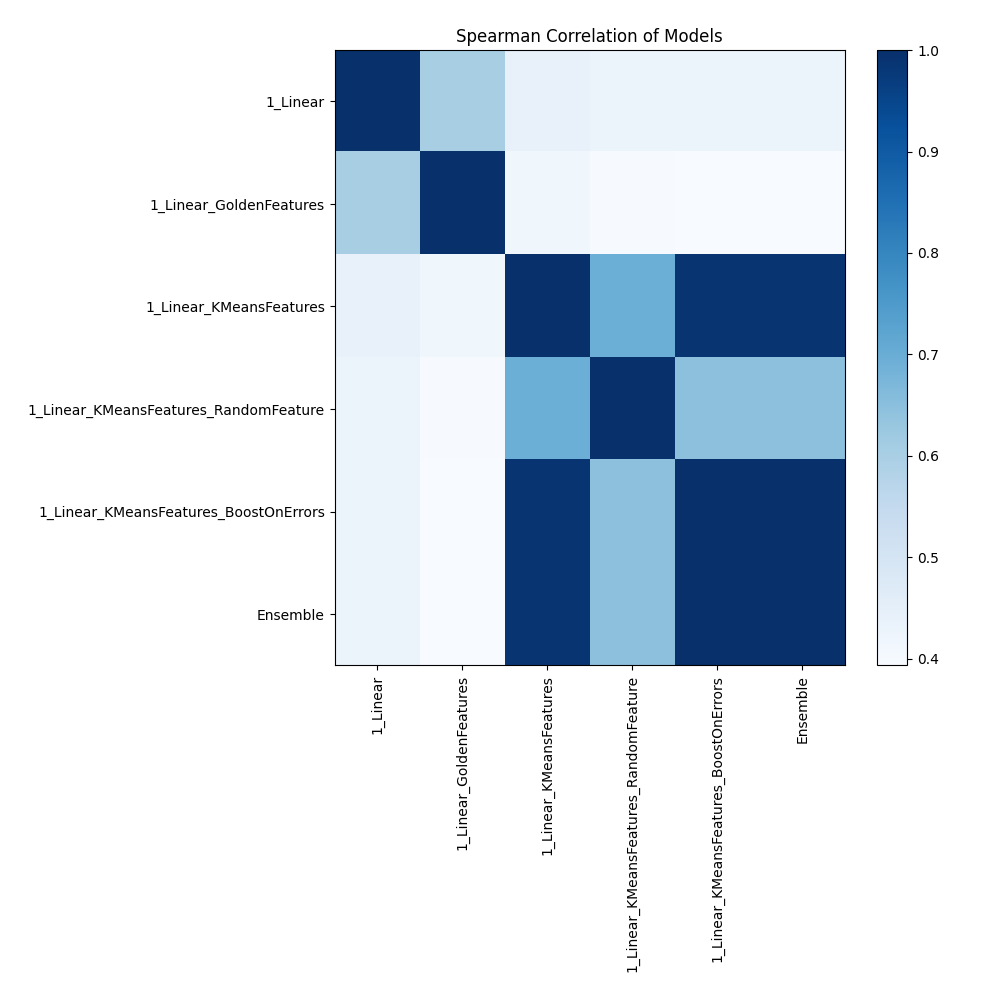

# AutoML Leaderboard

| Best model   | name                                                                                     | model_type   | metric_type   |   metric_value |   train_time |
|:-------------|:-----------------------------------------------------------------------------------------|:-------------|:--------------|---------------:|-------------:|
|              | [1_Linear](1_Linear/README.md)                                                           | Linear       | accuracy      |       0.610806 |         3.35 |
|              | [1_Linear_GoldenFeatures](1_Linear_GoldenFeatures/README.md)                             | Linear       | accuracy      |       0.608669 |         4.38 |
|              | [1_Linear_KMeansFeatures](1_Linear_KMeansFeatures/README.md)                             | Linear       | accuracy      |       0.617216 |         3.26 |
|              | [1_Linear_KMeansFeatures_RandomFeature](1_Linear_KMeansFeatures_RandomFeature/README.md) | Linear       | accuracy      |       0.612637 |         3.86 |
| **the best** | [1_Linear_KMeansFeatures_BoostOnErrors](1_Linear_KMeansFeatures_BoostOnErrors/README.md) | Linear       | accuracy      |       0.618437 |         3.09 |
|              | [Ensemble](Ensemble/README.md)                                                           | Ensemble     | accuracy      |       0.618437 |         1.03 |

### AutoML Performance

### AutoML Performance Boxplot

### Spearman Correlation of Models

